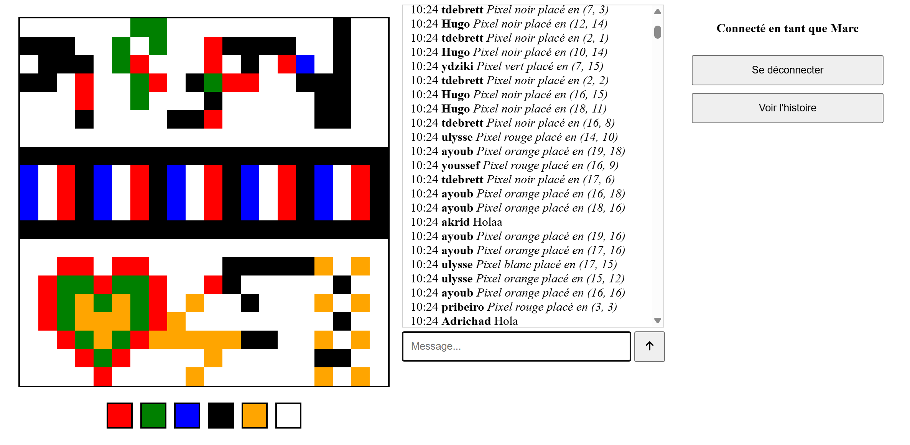
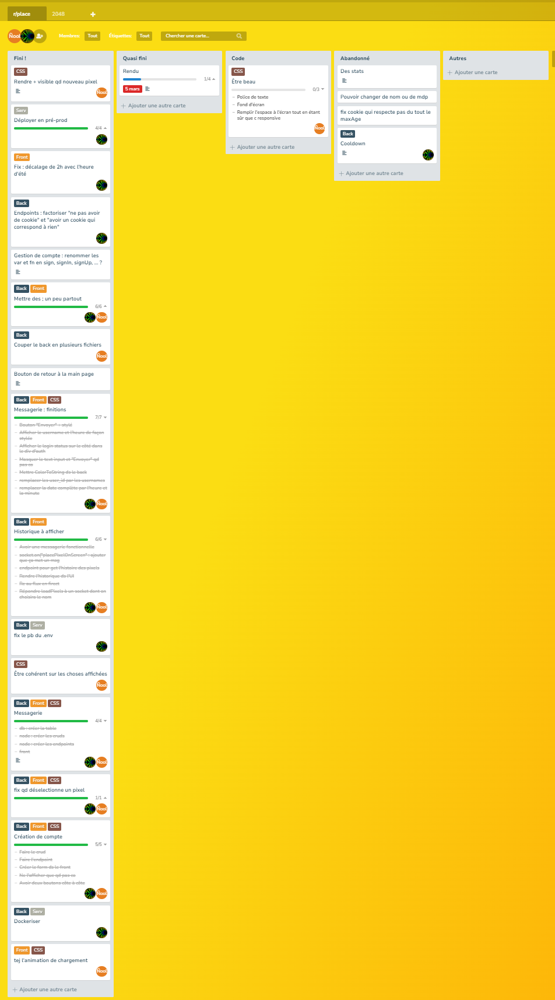

# Mini-raport pour le projet ELC-D03 : r/place

## Fonctionnalités

/!\ Nous avons visé à implémenter un maximum de fonctionnalités, le visuel n'est pas parfait.

### Grille interactive

Nous avions pour objectif de créer une grille de taille arbitraire avec laquelle les utilisateurs peuvent interagir en posant des pixels de différentes couleurs. 
Les utilisateurs peuvent voir les nouveaux pixels posés par les autres utilisateurs, et en temps réel grâce à des websockets. 

De plus ils peuvent poser n'importe où sur la grille des pixels de la couleur de leur choix parmi une palette.

### Système de placement de pixels

Lorsqu'un utilisateur connecté clique pour poser un pixel, une demande de placement de pixel est émise au serveur.
Le serveur valide la demande, met à jour la base de données, puis émet à tous les utilisateurs le placement d'un pixel.
A la réception, les navigateurs mettent à jour l'affichage.

Ainsi :
* l'information est centralisée : le serveur détient la vérité.
* on n'affiche pas à l'utilisateur un événement pas encore accepté : lorsqu'un utilisateur clique pour poser un pixel, l'interface ne se met à jour qu'après la validation par le serveur.

### Connexion

Nous voulions également permettre aux utilisateurs de *s'authentifier* avec une notion de compte.

#### Création de compte

Tout utilisateur peut créer un compte, avec seulement un nom et un mot de passe, pourvu que le nom n'ait pas encore été pris.

Comme dans un véritable service en production, nous ne stockons pas vos mots de passe, mais les *hash* de vos mots de passe. Ainsi :
* une fonction de hash étant (presque) injective, on peut s'assurer qu'un utilisateur essayant de se connecter a mis le bon mot de passe sans pour autant le connaître ;
* une personne ayant un accès à la base de données ne peut pas remonter à votre mot de passe, car de telles fonctions sont impossibles à inverser en pratique.

#### Authentification

Après avoir créé un compte, un utilisateur peut se "connecter", autrement dit s'authentifier (avec son nom et mot de passe) pour être recevoir certaines *autorisations*, ici le fait de poser un pixel et d'envoyer un message texte.

Après une authentification réussie, un token (d'accès) est créé, associé en base de données au compte, et l'utilisateur le reçoit dans un cookie.

Nous avions pour objectif d'avoir une connexion sécurisée avec un système de tokens.
En effet, le token seul fait foi pour s'assurer de l'accès à un compte.
Par la suite, les cookies étant automatiquement envoyés avec chaque requête HTTP ou émission websocket, le serveur reçoit automatiquement le token avec.

### Chat

Finalement, nous voulions ajouter un *chat* (messagerie instantanée) pour que les utilisateurs connectés puissent discuter entre eux, dans une seule conversation générale.
Chaque message contient une date, l'utilisateur à l'origine du message, et du texte pur.
La conversation est publique : bien que seuls les utilisateurs connectés puissent *écrire*, tout le monde peut *lire* les messages.

#### Justification

Cette fonctionnalité de messagerie instantanée, non-prévue au départ, a été rapidement implémentée après s'être rendu compte qu'*in fine*, poser un message, c'est comme poser un pixel, mais contenant du texte et non une couleur.
Le système de "placement de message" est analogue (pour ne pas dire identique) au système de placement de pixels, en deux temps séparés par une validation par le serveur. 

Une messagerie instantanée affichée sur le côté est monnaie courante dans les mini-jeux en ligne.
Nous avons décidé de implémenter cette fonctionnalité car elle est à *haute valeur ajoutée* :
* elle a été relativement rapide à ajouter ;
* elle est très attendue dans ce type de mini-jeu en ligne, et change complètement l'expérience de jeu.

#### Deux types de messages

Dans ce *chat*, on distingue deux types de messages :
* ceux envoyés directement par les utilisateurs ;
* les informations des pixels posés, créés automatiquement en tant que l'utilisateur venant de poser un pixel.

Ce dernier type de message fait office de logs du point de vue de l'utilisateur final, permettant d'appréhender l'historique des modifications...

#### Sécurité

La boîte de texte est le seul endroit de l'application où un utilisateur peut rentrer du contenu arbitraire, qui va être affiché sur les machines des autres utilisateurs.
Pour éviter des attaques par injection de code arbitraire, tous les tags (`<...>`) du texte d'un message sont retirés.
Ce choix quelque peu violent assure que le texte stocké en base de données est du texte plat au sens de HTML.

### Historique

...à ce propos, l'historique de tous les placements de pixels esr stocké.

Sur l'interface, il y a deux modes :
* le mode "direct" (par défaut) : montre l'état actuel en temps réel de la grille.
* le mode "history" : retrace l'historique sur la grille, dans l'ordre chronologique.

Dans le mode "history", les directives du serveur sont ignorées. Il est possible à tout moment de revenir au mode "direct", ce qui met fin à l'animation et affiche de nouvel état actuel.

## Technologies utilisées

### JavaScript

Ce langage permet de faire des applications web dynamiques et réactives.
La majorité du projet est en JavaScript : il fait tourner à la fois un script côté client (*as intended*) et tout le côté serveur via `Node.js`.

#### Express

L'application est basée sur Express, un framework pour Node.js. 
Cela permet de créer des applications web plus facilement.
Tous les endpoints de l'API sont gérés par Express.

Des modules Express tout faits permettent de facilement gérer et parser du JSON, du url-encoded et des cookies, et de servir en une seule ligne des fichiers statiques d'un dossier en bloquant l'accès hors de celui-ci.

#### Socket.io

Nous utilisons Socket.io pour la communication en temps réel entre le serveur et les clients via websockets. Les pixels ainsi que les messages du chat sont envoyés via Socket.io.

### Sqlite3

Nous utilisons Sqlite3 pour la base de données, via le package `better-sqlite3`.
Cela permet de stocker *durablement* les comptes utilisateurs, leurs tokens, les pixels, l'historique et les messages du chat.

Cette dépendance ne présente *a priori* aucun inconvénient à notre échelle, et de nombreux avantages :
* SQLite est du SQL : toute la syntaxe et les concepts nous sont connus.
* Étant du SQL, c'est une base de données relationnelle : on peut écrire en quelques lignes des requêtes puissantes, d'où un code simple, adapté à l'échelle du projet.
* `better-sqlite3` est facile d'utilisation.

A chaque démarrage du serveur, les tables sont créées si besoin.
Aucune colonne n'est nullable.
Les clefs primaires sont de simples entiers qui s'incrémentent pour les pixels, l'historique et les messages, car ils sont déjà publics.
Pour les tables d'utilisateurs et de tokens, qui contiennent des informations sensibles, la clef primaire est un morceau de UUID.
Le type `string` (court) est utilisé partout car les strings à mettre en base de données sont de longueur connues à l'avance.
A une exception près : le texte des message est de type `text` (long) pour autoriser l'écriture de (très) longs messages.

### Docker

Nous utilisons Docker pour packager et pour déployer notre application.
Cela permet de déployer l'application plus facilement et sur n'importe quelle machine.
Les commandes nécessaires sont incluses dans le [README.md](README.md).

Techniquement :
* le projet peut être build en une image (abstraite), grâce à un Dockerfile et un .dockerignore.
* à partir d'une image, on peut lancer un conteneur (concret) qui fait tourner l'image, grâce à un compose en YAML et éventuellement un .env et des volumes.

## Organisation

### Gestion de projet

Pour organiser et suivre les tâches, nous avons utilisé Planka, une alternative à Trello.
C'est un outil de gestion de projet, hébergé par ÉCLAIR, l'association d'informatique de l'école, dont nous faisons partie.

### Architecture du code

Bien ranger son code est essentiel pour la maintenabilité.

L'architecture parle d'elle-même :
* un dossier `back` pour le code côté serveur;
* un dossier `front` pour le code côté client;
* un dossier `compose` à part pour déployer le projet via Docker Compose.

Le découpage back-front se justifie par le besoin d'avoir tous les scripts côté serveur dans un même dossier, tout en servant statiquement un dossier.

Le dossier `back` se compose de 5 fichiers en Node.js :
* `server.js` : c'est le fichier principal à lancer, il sert de point d'entrée au projet. Il crée le serveur, sert statiquement le dossier `front`, met en place les endpoints et les websockets, et crée les tables SQL si besoin.
* `endpoints.js` : ils reçoivent les requêtes HTTP, traitent leur contenu (endpoint, query params, cookies, redirections, ...) et font appel à des CRUDs.
* `socket.js` : c'est l'homologue de `endpoints.js` pour les websockets. Ensemble ces deux fichiers forment une API complète. Ils s'occupent à la fois de recevoir et d'émettre les pixels et les messages, assurant une communication en temps réel. Comme pour les requêtes HTTP, le cookie automatiquement envoyé est traité.
* `cruds.js` : ce sont des fonctions prêtes à l'emploi et les seules qui interagissent directement avec la base de données (pour Create, Read, Update ou Delete du contenu). Elles servent à masquer l'usage de la base de données dans l'API.
* `utils.js`

## Difficultés rencontrées

### Lancement du projet : poser de bonnes bases

Il a été difficile pour nous de bien démarrer le projet. Nous avons du essayer différentes librairies de bdd avant de trouver celle qui nous convenait (better-sqlite3).

### Cookies

Initialement, pour que le client manipule son token, il fallait qu'il lisent les cookies. Le serveur les déposaient en http only, ce qui empêchait le client de les lire. 
Finalement, au chargement de la page, le client établi avec le serveur une connexion websocket, et le serveur lui envoie le cookie.

## Ouverture

On aurait pu aussi mettre ces features :
* Cooldown (temps d'attente, mesure anti-spam)
* Gestion de compte : modifier son username ou mdp, récupérer un mdp oublié
* Associer un compte à une adresse mail : pourvu qu'on puisse envoyer des mails
* Afficher des statistiques : nombre d'utilisateurs (en ligne ou au total), nombre de pixels posés, temps passés, etc.
* Système de modération : bannir un utilisateur, supprimer un message, etc.
* Des migrations de bdd : pour éviter de supprimer toutes les données à chaques nouveautés de l'application dans la bdd
