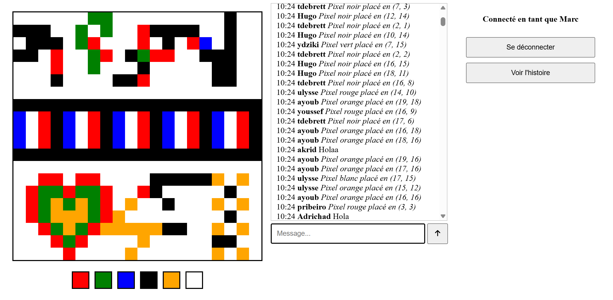

# ELC-D03

Projet de l'électif "Applications Web" : recréer un [r/place](https://en.wikipedia.org/wiki/R/place)



## Développement

### Configurer le projet

Dans `backend`, dupliquer `.env.template` en `.env`, et mettre les bonnes valeurs.

### Lancer le projet

#### Windows

```sh
node --env-file=back\.env .\back\server.js
```

#### Autre (Unix-based)

```sh
node --env-file=back/.env back/server.js
```

### Build l'image Docker du projet

```sh
docker build -t rplace:1.0 .
```

## Docker

### Configurer le projet

* Créer un dossier puis se placer dedans
* Créer quelque part un dossier qui servira de volume pour la base de données
* Remplir un `docker-compose.yml`
    * Bien mettre le chemin du volume
    * Choisir le port local, sachant que le port exposé par l'image est le 3000

### Lancer le projet

```sh
docker compose up -d
```
